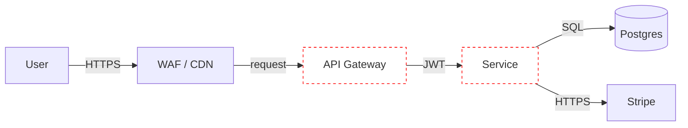

# Threat Modeling — Pre-Implementation Security Design

Run a structured threat-modeling session against a proposed feature, system, or architecture. This is the *design-time* security skill — different from audit (which inspects code that exists). Use this when there's a design doc, a feature spec, an architecture diagram — but not yet code.

When to use:
- New feature touching auth, payments, multi-tenant data, or sensitive PII
- New external integration (third-party API, OAuth provider, webhook receiver)
- New service / microservice being added to the architecture
- Significant refactor of a security-sensitive component
- Before committing to a major architecture decision (event-driven vs request/response, monolith split, AI-feature introduction)

Cross-references: `owasp-audit` (code-level checklist that lines up with the threats this surfaces), `api-audit` (API-specific category mapping), `iam-audit` (identity decisions touch every threat model).

## The four questions

Adam Shostack's framing — every threat model answers these four:

1. **What are we working on?** (Scope and model)
2. **What can go wrong?** (Threats)
3. **What are we going to do about it?** (Mitigations)
4. **Did we do a good job?** (Validation)

The rest of this skill walks through each in order.

## Step 1 — What are we working on?

Produce a Data Flow Diagram (DFD) at one of three levels:

- **Level 0** — Context diagram. One bubble for the system, lines to every external entity (users, third-party APIs, internal admin tools). Use this when the question is "what does this system even touch?"
- **Level 1** — Major processes. Auth service, API gateway, primary data store, payment integration, etc. Use this for most feature-level threat models.
- **Level 2** — Detailed component model. Specific endpoints, specific tables, specific queues. Use this for the trickiest parts only.

A useful DFD has:
- **External entities** (rectangles) — users, third-party services, admins
- **Processes** (circles) — your services, functions, handlers
- **Data stores** (parallel lines / cylinders) — databases, caches, blob storage, queues
- **Data flows** (arrows, labeled with what crosses) — request bodies, tokens, files, events
- **Trust boundaries** (dashed lines) — every crossing is a place data is validated, authenticated, or filtered

Trust boundaries are the most useful element. If you can draw exactly one diagram that shows every trust boundary in your feature, you've already done 60% of the work.

For text-only environments, render the DFD in Mermaid:



## Step 2 — What can go wrong? (STRIDE)

For each process, data store, and data flow, ask STRIDE — one threat category per letter. Not every category applies to every element, and that's fine.

| Letter | Threat | Property violated | Examples |
|---|---|---|---|
| **S** | **Spoofing** | Authentication | Stolen token, forged JWT, replay attack, impersonating a service |
| **T** | **Tampering** | Integrity | Modifying a request mid-flight, parameter tampering, modifying stored data |
| **R** | **Repudiation** | Non-repudiation | User denies an action; logs don't prove they did it |
| **I** | **Information Disclosure** | Confidentiality | Leak via error messages, IDOR exposing other users' data, exposed S3 bucket |
| **D** | **Denial of Service** | Availability | Resource exhaustion, expensive query bomb, billing exhaustion via paid downstream APIs |
| **E** | **Elevation of Privilege** | Authorization | User → admin via mass assignment, BFLA, escape from sandbox |

### STRIDE per element

A useful threat-modeling habit: for each element of the DFD, write a short table.

```markdown
**Element:** API Gateway

| STRIDE | Threat | Likelihood | Impact |
|---|---|---|---|
| S | Forged JWT — symmetric secret in env, leaks if .env exposed | M | H |
| T | Request body modified between gateway and upstream service | L | M |
| R | Gateway access logs deleted by attacker post-breach | L | H |
| I | Verbose error responses expose internal hostnames | M | L |
| D | No rate limit at the gateway → upstream services overwhelmed | H | H |
| E | "X-Admin: true" header pass-through from external requests | L | C |
```

Likelihood and impact: L / M / H / C(ritical) — qualitative is fine; quantitative scoring is theater for most engagements.

### Abuse cases (sister to STRIDE)

For features with business-flow concerns, also walk abuse cases. The format is:

```
As a malicious actor, I want to [goal] so that I can [outcome].
```

Examples:
- As a malicious customer, I want to redeem the same coupon code 100 times so that I can drain the discount budget
- As a competitor, I want to scrape every product detail in bulk so that I can clone your catalog
- As an insider with read access, I want to extract every customer's PII over a year so that I can sell it without triggering DLP alerts

Abuse cases catch what STRIDE misses — STRIDE is great at "security properties violated"; abuse cases are great at "business intent violated."

## Step 3 — What are we going to do about it?

For each threat surfaced in Step 2, pick one of four responses:

- **Mitigate** — design a control that reduces likelihood or impact
- **Transfer** — push the risk to someone else (Stripe handles PCI compliance, Vercel handles DDoS)
- **Accept** — document the residual risk and the rationale
- **Avoid** — don't build the feature this way; redesign

Mitigations should be specific:

| Bad mitigation | Good mitigation |
|---|---|
| "Add rate limiting" | "Add 5 req/min per user IP to /api/coupon/redeem, with Redis-backed counter; queue 429 responses to be alerted on" |
| "Validate inputs" | "Reject `?next=` URLs that contain control bytes (\\t, \\n, \\0), backslashes, or percent-encoded slashes; normalize via `new URL(target, ...).pathname` (see owasp-audit A01)" |
| "Encrypt the data" | "Application-level encryption with AWS KMS-managed CMK, envelope encryption per row, key rotation every 90 days, audit log of every Decrypt call" |

### Common mitigation patterns

- **Spoofing → strong identity** — short-lived tokens, MFA, mutual TLS, signed requests, workload identity federation (see `iam-audit`)
- **Tampering → integrity controls** — HMAC, signed cookies, transport encryption, write-ahead logs, immutable infrastructure
- **Repudiation → audit logs** — immutable append-only logs, separate logging account, alerting on log-tampering attempts
- **Information disclosure → minimum exposure** — least-privilege IAM, data classification, encryption at rest and in transit, DTOs not whole records (see `api-audit` API3)
- **Denial of service → resource limits** — rate limits, quotas, query depth limits, billing alarms, circuit breakers
- **Elevation of privilege → authorization checks** — centralized `can(user, action, resource)`, deny-by-default, sister-route audit (see `owasp-audit` A04 sister-route)

## Step 4 — Did we do a good job?

Validation comes from three sources:

1. **Coverage check** — every element in the DFD has a STRIDE table; every threat has a mitigation; every mitigation has an owner and a deadline. Missing rows are the most common failure.
2. **Adversarial second pass** — invite someone who wasn't in the original session (or another model, in this skill's context). Ask "what did we miss?" with explicit prompt to break correlated blind spots. See `owasp-audit` Second-Opinion Pass.
3. **Trace to tests** — every High/Critical mitigation should have a test (unit, integration, or canary in production monitoring). If you can't write the test, you don't have the mitigation, you have an intention.

## When to threat model (and when not to)

**Worth it:**
- New auth flow / new payment integration / new third-party data exchange
- Multi-tenant data model
- Anything touching admin functionality, billing, or sensitive PII
- Significant architecture changes
- AI features (see `prompt-injection`)

**Probably not worth it:**
- Internal CRUD on data you already have well-modeled
- UI-only changes
- Refactors that don't change trust boundaries

The test: if the change introduces a new trust boundary, moves an existing one, or changes what crosses one — threat model it. Otherwise, skip.

## Output Format

A threat model is a living document, not a one-shot report. Keep it short and reviewable.

```markdown
# Threat Model: [Feature / System Name]
## Status: Draft / In Review / Approved
## Owner: [name]
## Date: [date]
## Reviewers: [names]

## 1. Scope
[2-3 sentences — what's in, what's out]

## 2. Data Flow Diagram
[Mermaid diagram or link to image]

## 3. Assumptions and constraints
- [Anything taken as given — e.g. "users authenticate via Okta, MFA enforced"]

## 4. Threats and mitigations
[STRIDE-per-element tables, then abuse cases]

## 5. Open questions
[Things we deferred or couldn't decide]

## 6. Decision log
[Material design decisions and why — including risks accepted]

## 7. Action items
| Item | Owner | Deadline | Status |
|------|-------|----------|--------|
```

Keep this in the repo alongside the design doc, not in a separate security tracker. Drift between the threat model and the implementation is the dominant failure mode — proximity helps.

## Boundaries

- This skill produces planning artifacts, not exploitation
- Threat models surface risks; they don't grant authority to test them — pair with `web-pentest` or `owasp-audit` for verification
- Don't threat-model someone else's product without authorization (e.g., generating an attack tree of a competitor)
- Threat models that don't get reviewed and signed off are noise — push back if the user is producing a model nobody will read

## References

- "Threat Modeling: Designing for Security" — Adam Shostack
- Microsoft STRIDE methodology
- OWASP Threat Modeling Cheat Sheet
- OWASP pytm / threatspec (tooling)
- "Threat Modeling Manifesto" (threatmodelingmanifesto.org)
- Mozilla Rapid Risk Assessment (RRA) framework
- NIST SP 800-154 (Guide to Data-Centric System Threat Modeling)
