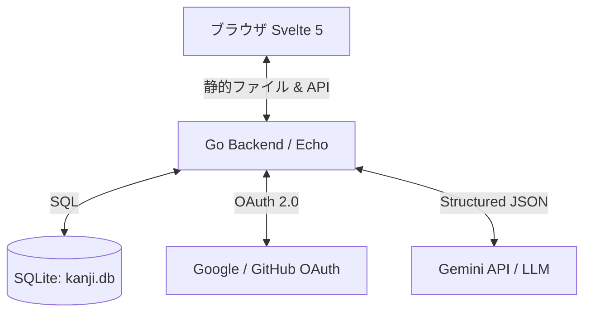

# AIサポート付き日程調整アプリ「幹事ちゃん (Kanji-Chan)」仕様・設計書

本プロジェクトは、日本の定番日程調整ツール「調整さん」のようなUI/UXを持ちつつ、AIのサポート（自然文でのイベント作成、AIによる最適な日程の自動絞り込み・提案）を受けられる日程調整アプリケーションです。

---

## 1. 技術スタック

- **Backend**: Go 1.26+ (実装は互換性重視で Go 1.23+ の機能を利用しつつ `go.mod` に 1.26 を指定)
- **Frontend**: Svelte 5 (Latest Runes) + Bun
- **Database**: SQLite (埋め込みデータベース。1コンテナ構成)
- **Infrastucture**: Docker Compose (シングルコンテナ構成。`podman-compose` にも対応)
- **OAuth**: Google または GitHub OAuth 2.0
- **AI Engine**: Gemini API (または OpenAI API。デフォルトは Gemini API)

---

## 2. システム構成



### ディレクトリ構成案

```text
kanji-chan/
├── AGENTS.md               # 本ドキュメント
├── docker-compose.yml      # Docker Compose 設定ファイル
├── .gitignore
├── .env.example            # 環境変数のサンプル
├── backend/                # Go バックエンド
│   ├── cmd/
│   │   └── server/
│   │       └── main.go     # エントリーポイント
│   ├── internal/
│   │   ├── auth/           # OAuth, セッション管理
│   │   ├── database/       # DB接続、マイグレーション、クエリ
│   │   ├── handler/        # HTTP ハンドラー (API)
│   │   ├── model/          # 構造体定義
│   │   └── ai/             # Gemini API 連携ロジック
│   ├── go.mod
│   └── go.sum
└── frontend/               # Svelte 5 フロントエンド (SvelteKit)
    ├── src/
    │   ├── routes/         # ルーティングとページ
    │   ├── lib/            # 共通コンポーネント、APIクライアント
    │   └── app.html
    ├── package.json
    ├── svelte.config.js
    └── vite.config.js
```

---

## 3. 主要機能とワークフロー

### ① 管理者・幹事の OAuth ログイン
- 幹事（作成者）は、Google または GitHub 経由でログインします。
- ログイン用の環境変数設定:
  - `OAUTH_PROVIDER` (google または github)
  - `OAUTH_CLIENT_ID`
  - `OAUTH_CLIENT_SECRET`
  - `OAUTH_REDIRECT_URI`
  - `SESSION_SECRET` (Cookieセッション署名用)
- ログイン後、セッションCookie（またはJWT）が発行され、自身が作成したイベント一覧の管理やAI APIキーの設定を行えるようになります。
- **AI APIキー設定**: 幹事は管理画面から自身の Gemini API キーを登録・更新できます（データベースに暗号化して保存、または環境変数 `GEMINI_API_KEY` をフォールバックとして使用）。

### ② 自然文によるイベント（調整）作成 (AIサポート)
- 幹事が「来週の平日夜、渋谷で飲み会をやりたい。候補日は3つくらい」といった自然文を入力します。
- バックエンドはこれを LLM (Gemini API) に送信し、以下の構造化 JSON を返させます。
  ```json
  {
    "title": "渋谷飲み会",
    "description": "来週の平日夜に開催する渋谷での飲み会です。",
    "candidates": [
      { "date": "2026-07-13", "start_time": "19:00", "end_time": "21:00" },
      { "date": "2026-07-14", "start_time": "19:00", "end_time": "21:00" },
      { "date": "2026-07-15", "start_time": "19:00", "end_time": "21:00" }
    ]
  }
  ```
- フロントエンドはこの JSON を受け取り、作成フォームに自動で値を入力します。幹事は必要に応じて調整・微修正してイベントを確定し、回答用URLを発行します。

### ③ 回答者による日程入力（ログイン不要）
- 回答用URL（例: `/event/[event_uuid]`）にアクセスした参加者は、名前、各候補日に対する回答（〇: 可, △: 条件付き可, ×: 不可）、およびコメントを入力して送信します。
- この操作には OAuth ログインは不要です。

### ④ AI による候補日の絞り込み・提案
- 全員の回答が揃った後、幹事は管理画面で「AIに日程を決定してもらう」ボタンをクリックします。
- バックエンドは、回答結果の一覧（誰がいつ 〇/△/× をつけたか）と幹事の優先条件（「なるべく参加人数を多くしたい」「Aさんは必須参加」「平日のほうが良い」など）を LLM に送ります。
- LLM は、最も適した開催候補日をスコア（例: 〇=2点, △=1点, ×=0点）や必須参加者の都合を考慮して分析し、以下の形式で提案します。
  - **提案候補日ランキング (Top 3)**
  - **各候補日の選定理由・分析結果**（例: 「7/14(火)は全員が参加可能です」「7/13(月)は参加人数は最大になりますが、Aさんが不参加になります」など）
- 幹事はこの提案を見て最終決定し、イベントのステータスを「確定」に更新します。確定した日程は参加者に共有されます。

---

## 4. データベース設計 (SQLite)

```sql
-- ユーザーテーブル (管理者・幹事)
CREATE TABLE users (
    id INTEGER PRIMARY KEY AUTOINCREMENT,
    oauth_provider VARCHAR(50) NOT NULL,
    oauth_id VARCHAR(255) NOT NULL,
    email VARCHAR(255) NOT NULL,
    name VARCHAR(255) NOT NULL,
    gemini_api_key VARCHAR(255), -- 暗号化して保存
    created_at TIMESTAMP DEFAULT CURRENT_TIMESTAMP,
    UNIQUE(oauth_provider, oauth_id)
);

-- イベントテーブル
-- SQLiteではGORMのBeforeCreateフックでGo側からUUIDを生成して挿入します
CREATE TABLE events (
    id TEXT PRIMARY KEY, -- UUID文字列
    title VARCHAR(255) NOT NULL,
    description TEXT,
    created_by INTEGER REFERENCES users(id) ON DELETE SET NULL,
    status VARCHAR(50) DEFAULT 'scheduling', -- 'scheduling' (調整中) or 'confirmed' (確定)
    confirmed_candidate_id INTEGER, -- 最終確定した候補日時ID
    created_at TIMESTAMP DEFAULT CURRENT_TIMESTAMP
);

-- イベント候補日時テーブル
CREATE TABLE event_candidates (
    id SERIAL PRIMARY KEY,
    event_id UUID REFERENCES events(id) ON DELETE CASCADE,
    event_date DATE NOT NULL,
    start_time TIME NOT NULL,
    end_time TIME NOT NULL
);

-- eventsテーブルに外部キーを追加 (循環参照回避のため後から追加)
ALTER TABLE events ADD CONSTRAINT fk_confirmed_candidate FOREIGN KEY (confirmed_candidate_id) REFERENCES event_candidates(id);

-- 回答者テーブル
CREATE TABLE responses (
    id SERIAL PRIMARY KEY,
    event_id UUID REFERENCES events(id) ON DELETE CASCADE,
    respondent_name VARCHAR(255) NOT NULL,
    comment TEXT,
    created_at TIMESTAMP DEFAULT CURRENT_TIMESTAMP
);

-- 候補日時に対する回答テーブル
CREATE TABLE candidate_answers (
    id SERIAL PRIMARY KEY,
    response_id INT REFERENCES responses(id) ON DELETE CASCADE,
    candidate_id INT REFERENCES event_candidates(id) ON DELETE CASCADE,
    answer_status VARCHAR(10) NOT NULL, -- 'ok' (〇), 'maybe' (△), 'ng' (×)
    UNIQUE(response_id, candidate_id)
);
```

---

## 5. API エンドポイント設計

### 認証関連 (OAuth)
- `GET /api/auth/login` - OAuthプロバイダへのリダイレクト
- `GET /api/auth/callback` - OAuthコールバックの処理、セッション確立
- `POST /api/auth/logout` - ログアウト
- `GET /api/auth/me` - 現在ログインしているユーザー情報の取得

### イベント関連
- `POST /api/events` - 新規イベント作成（幹事専用）
- `GET /api/events` - ログインユーザーが作成したイベント一覧（幹事専用）
- `GET /api/events/:uuid` - イベント詳細および回答状況の取得（ログイン不要）
- `PUT /api/events/:uuid` - イベント情報の更新・日程確定（幹事専用）
- `DELETE /api/events/:uuid` - イベントの削除（幹事専用）

### 回答関連
- `POST /api/events/:uuid/responses` - 回答の追加（ログイン不要）
- `PUT /api/events/:uuid/responses/:id` - 回答の編集（ログイン不要。※編集用トークンをCookieやLocalStorageで保持するか、シンプルに回答者による自己申告）
- `DELETE /api/events/:uuid/responses/:id` - 回答の削除

### AI サポート関連
- `POST /api/ai/parse-event` - 自然文からイベント名・候補日を解析（幹事専用）
  - リクエスト: `{"text": "来週の平日夜、渋谷で飲み会。候補日3つ"}`
  - レスポンス: 候補日時、タイトル、説明のJSON
- `POST /api/ai/suggest-schedule` - 回答結果から候補日を絞り込む提案（幹事専用）
  - リクエスト: `{"event_id": "...", "preferences": "Aさんは必須"}`
  - レスポンス: 提案候補日リスト、選定理由のテキスト

---

## 6. 実装フェーズおよびタスクリスト

- [x] **Phase 1: 環境構築とDocker構成**
  - [x] `docker-compose.yml` の作成 (PostgreSQL, Go, Svelte)
  - [x] Go バックエンド of プロジェクト初期化 (`go.mod`, `main.go`)
  - [x] Bun による Svelte 5 プロジェクトの初期化
- [x] **Phase 2: データベース構築とバックエンドの基礎設計**
  - [x] PostgreSQL接続とマイグレーションのセットアップ
  - [x] OAuth 2.0 (Google/GitHub) 認証ロジックの実装
  - [x] イベント、候補日、回答スキーマのモデル化とCRUD実装
- [x] **Phase 3: AI機能 (Gemini API) の実装**
  - [x] Gemini API クライアントの実装
  - [x] 自然文入力からイベント候補日時を抽出するプロンプトとパーサーの実装
  - [x] 全員の回答から最適日時を分析・推奨するロジックの実装
- [x] **Phase 4: フロントエンドの実装 (Svelte 5 Runes)**
  - [x] Svelte 5の `$state` / `$derived` / `$props` を用いた状態管理の設計
  - [x] 幹事ログイン画面、イベント作成（自然文入力アシスト）画面
  - [x] 回答画面（調整さん風の使いやすいテーブルUI、〇△×入力）
  - [x] 管理・結果集計画面（AI提案の表示、日程確定機能）
  - [x] Vanilla CSSによる洗練されたモダンUI (Glassmorphism, ダークモード)
- [x] **Phase 5: 統合テストと微調整**
  - [x] OAuthからイベント作成、回答、AI絞り込みまでの一連のフローテスト
  - [x] エラーハンドリングとセキュリティ対策 (APIキーの暗号化等)
