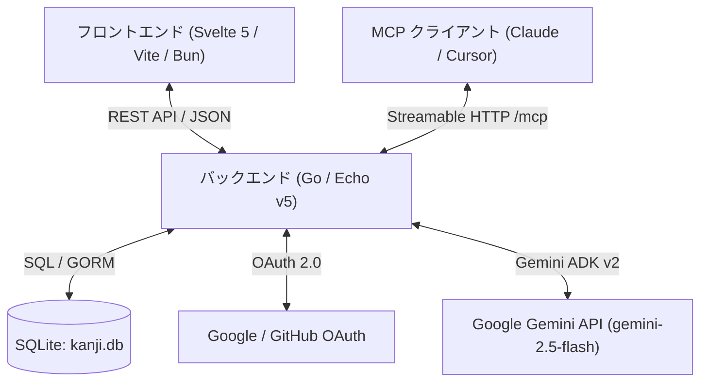

# 幹事ちゃん (Kanji-Chan) 🍶📅

> **AIが日程調整をスマートにアシストする、次世代の日程調整Webアプリケーション**

[](https://go.dev/)
[-FF3E00?style=flat-square&logo=svelte)](https://svelte.dev/)
[](https://www.sqlite.org/)
[](https://modelcontextprotocol.io/)
[](https://www.docker.com/)

**幹事ちゃん (Kanji-Chan)** は、日本の定番日程調整サービス「調整さん」のようなシンプルで直感的な操作感を保ちながら、最新AI (Google Gemini API / ADK) によるサポートや MCP (Model Context Protocol) 統合、動的 OGP 画像生成機能を搭載したモダンな日程調整ツールです。

---

## 🌟 主な特徴

### 1. 🤖 自然文入力によるイベント自動作成 (AIアシスト)
- 「来週の平日夜、渋谷で飲み会をしたい。候補日は3つ」といった自然文をテキスト入力するだけで、AIがイベントの**タイトル・詳細説明・候補日時リスト**を自動抽出・入力します。
- 幹事はAIが生成した候補を確認・微修正するだけで即座に調整ページを発行可能です。

### 2. ⚡ 回答者ログイン不要 & 直感的な〇△×回答
- 回答者はログイン一切不要。イベントの共有用URL（`/event/[uuid]`）にアクセスし、名前と候補日時に対する **〇 (可) / △ (条件付き可) / × (不可)** を選択するだけで回答が完了します。
- ブラウザに編集トークンが保持されるため、後からの回答修正・削除もスムーズです。

### 3. 🎯 AIによる最適日程の絞り込み・自動提案
- 「全員の回答が集まったけれど、どの日に確定すればいいか迷う…」という幹事のために、AIが回答結果を分析。
- スコアリング（〇=2点, △=1点, ×=0点）に加えて、「幹事の優先条件」（例: *「キーパーソンAさんは必須参加」「平日の夜を優先」*）を考慮し、**おすすめ候補日TOP3と詳細な選定理由**を自動提案します。

### 4. 🔌 Streamable HTTP MCP (Model Context Protocol) サーバー内蔵
- エンドポイント `/mcp` を介して、Claude Desktop や Cursor、自作AIエージェントなどの外部LLMクライアントと直接連携可能。
- 幹事ちゃん API キー (`kc_...`) またはセッション認証を用いて、エージェント経由でイベントの一覧取得、詳細閲覧、作成、更新、削除を自動実行できます。

### 5. 🖼️ リアルタイム OGP 画像自動生成
- イベントのタイトルや開催候補日時を組み込んだアイキャッチ画像をサーバーサイド (`golang.org/x/image` / `freetype`) で動的に生成 (`/api/ogp/[uuid]`)。
- LINE, Discord, Twitter/X, Slack などの SNS / メッセージングアプリでURLをシェアした際に、調整内容が一目で伝わる美しいカード画像を表示します。

---

## 🏗️ システム構成 & 技術スタック



- **Backend**: Go 1.23+ / [Echo Framework](https://echo.labstack.com/) / [GORM](https://gorm.io/) / [Google Agent Development Kit (ADK v2)](https://github.com/google/adk-go) / [MCP Go SDK](https://github.com/modelcontextprotocol/go-sdk)
- **Frontend**: [Svelte 5](https://svelte.dev/) (Runes: `$state`, `$derived`, `$props`) / SvelteKit / [Vite](https://vitejs.dev/) / Bun / Vanilla CSS (Glassmorphism & Dynamic Dark Mode)
- **Database**: SQLite (1コンテナ埋め込み・ボリューム永続化)
- **Container**: Docker / Docker Compose / Podman Compose

---

## 🚀 クイックスタート

### 1. Docker Compose による実行 (推奨)

リポジトリをクローンし、環境変数ファイルを用意します。

```bash
git clone https://github.com/sweetfish329/kanji-chan.git
cd kanji-chan

# 環境変数の準備
cp .env.example .env
```

`.env` 内の `OAUTH_CLIENT_ID` や `OAUTH_CLIENT_SECRET` をご自身の環境に合わせて設定した後、Docker Compose を起動します。

```bash
docker compose up -d
```

起動後、ブラウザで [http://localhost:8080](http://localhost:8080) にアクセスします。

---

### 2. GHCR 公開イメージを用いた本番デプロイ (`deploy/`)

GitHub Actions の CI/CD で自動ビルド・プッシュされる公開 Docker イメージ (`ghcr.io/sweetfish329/kanji-chan:latest`) を利用して本番環境へデプロイする場合は、`deploy/` ディレクトリ配下の設定ファイルを使用します。

```bash
# 設定ファイルの取得
mkdir -p kanji-chan && cd kanji-chan
curl -sSL -O https://raw.githubusercontent.com/sweetfish329/kanji-chan/main/deploy/compose.yaml
curl -sSL -O https://raw.githubusercontent.com/sweetfish329/kanji-chan/main/deploy/.env.example

# .env の設定と起動
cp .env.example .env
# .env 内の OAuth 情報等を設定後
docker compose pull && docker compose up -d
```

詳細な設定方法や Nginx/Caddy リバースプロキシ構築例、バックアップ手順については [deploy/README.md](deploy/README.md) を参照してください。

---

### 3. ローカル開発環境での起動

#### 前提条件
- Go 1.23 以上
- Bun 1.0 以上 (または Node.js / npm)

#### バックエンド & フロントエンドのビルド・起動

```bash
# 1. フロントエンドの依存関係インストールとビルド
cd frontend
bun install
bun run build
cd ..

# 2. バックエンドの起動 (ビルドされたフロントエンド資産を embed 配信)
cd backend
go run cmd/server/main.go
```

開発モードでフロントエンドを HMR (Hot Module Replacement) 動作させたい場合:

```bash
# Terminal 1 (Backend)
cd backend
go run cmd/server/main.go

# Terminal 2 (Frontend)
cd frontend
bun run dev
```

---

## ⚙️ 環境変数一覧

| 変数名 | 説明 | デフォルト値 |
| :--- | :--- | :--- |
| `PORT` | サーバーのListenポート | `8080` |
| `DB_TYPE` | データベース種別 | `sqlite` |
| `DB_PATH` | SQLite DB ファイルの保存パス | `/data/kanji.db` (ローカル時は `backend/kanji.db`) |
| `OAUTH_PROVIDER` | OAuth プロバイダ (`google` または `github`) | `google` |
| `OAUTH_CLIENT_ID` | OAuth クライアント ID | -(必須設定)- |
| `OAUTH_CLIENT_SECRET` | OAuth クライアント シークレット | -(必須設定)- |
| `OAUTH_REDIRECT_URI` | OAuth コールバック URI | `http://localhost:8080/api/auth/callback` |
| `SESSION_SECRET` | Cookie セッション署名用シークレット | 未指定時は起動毎にランダム生成 |
| `PUBLIC_SITE_URL` | SEO / OGP 生成用の公開サイト基底URL | `http://localhost:8080` |

---

## 🤖 Model Context Protocol (MCP) サーバー機能

幹事ちゃんは `/mcp` エンドポイントで Streamable HTTP MCP サーバーとして動作します。
管理画面 (`/admin`) で発行した **幹事ちゃん API キー (`kc_...`)** を `Authorization: Bearer kc_...` ヘッダーに付与することで、外部のAIエージェントから操作可能です。

### 提供ツール一覧

| ツール名 | 説明 | 主要引数 |
| :--- | :--- | :--- |
| `list_events` | ログインユーザーが作成したイベント一覧を取得 | なし |
| `get_event` | イベント詳細（候補日時、全回答者の〇△×状態）を取得 | `event_id` (UUID) |
| `create_event` | 新規イベントを作成 | `title`, `description`, `candidates` |
| `update_event` | イベントのタイトル/説明変更、開催日時の決定(確定) | `event_id`, `title`, `status`, `confirmed_candidate_id` |
| `delete_event` | イベントの削除 | `event_id` |

---

## 📄 ディレクトリ構造

```text
kanji-chan/
├── AGENTS.md               # AIエージェント開発指示書・プロジェクト詳細仕様
├── compose.yml             # Docker Compose 設定
├── backend/                # Go バックエンド
│   ├── cmd/server/main.go  # エントリーポイント (Echo, Embed FS, SPA, SEO)
│   ├── internal/
│   │   ├── ai/             # Gemini API & ADK v2 連携ロジック
│   │   ├── auth/           # OAuth 2.0 & APIキー認証
│   │   ├── database/       # SQLite / GORM データベース設定
│   │   ├── handler/        # HTTP API ハンドラー & OGP 画像動的生成
│   │   ├── mcp/            # Streamable HTTP MCP サーバー実装
│   │   └── model/          # GORM データモデル構造体
│   └── Dockerfile
└── frontend/               # Svelte 5 フロントエンド
    ├── src/
    │   ├── routes/         # SvelteKit ルーティング (+page.svelte, /admin, /event)
    │   ├── lib/            # UIコンポーネント & APIクライアント
    │   └── app.css         # Glassmorphism & Modern Dark Theme
    └── vite.config.ts
```

---

## 📜 ライセンス

[MIT License](LICENSE)
